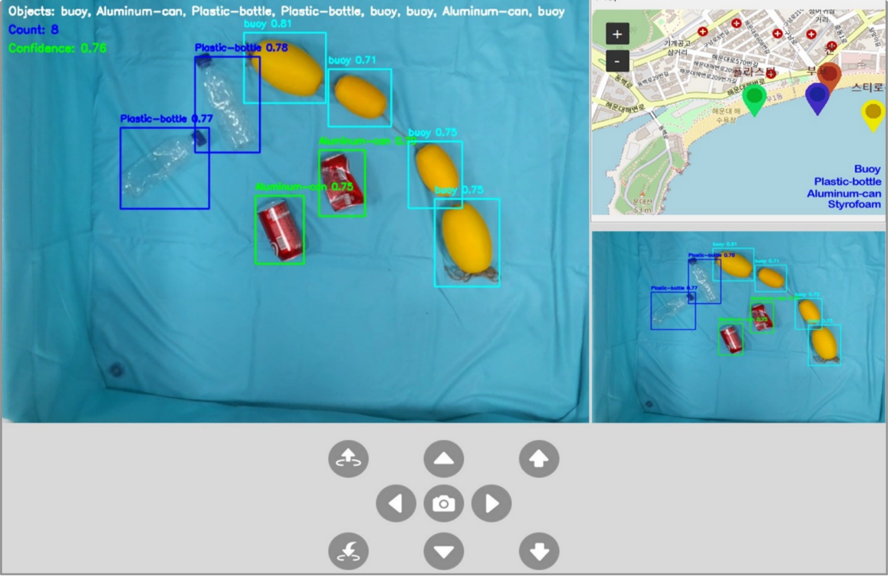
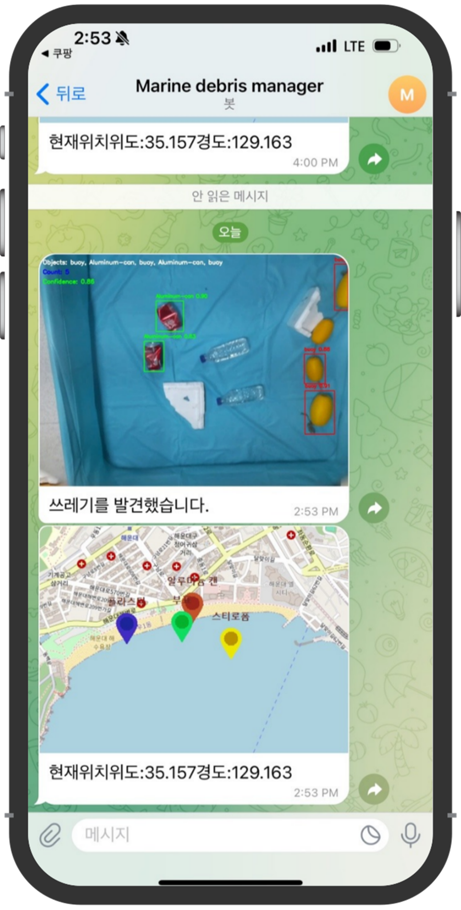

# 🌊 실시간 해양 쓰레기 탐지 및 지도 플랫폼

> **드론 + YOLO + 텔레그램 + GUI 올인원 AI 프로젝트**



---

## 📌 프로젝트 소개

드론을 활용해 해양 쓰레기를 촬영하고, YOLOv8 모델로 객체를 실시간 탐지한 후  
GUI를 통해 시각화하고 지도 위에 위치 정보를 표시하는 시스템입니다.

탐지된 결과는 자동으로 캡처되어 **텔레그램으로 전송**되며,  
사용자는 `Tkinter` 기반 인터페이스로 드론의 상태와 실시간 영상, 위치를 확인할 수 있습니다.

---


## 💬 텔레그램 연동 예시

| 탐지 결과 자동 전송 메시지 |
|----------------------------|
|  |

- 객체 탐지 시 캡처 이미지 전송  
- 탐지 위치 지도 전송  
- 위도/경도 정보 자동 포함

## 🛠 사용 기술 스택

| 구분 | 기술 |
|------|------|
| AI 모델 | YOLOv8 (Roboflow에서 학습) |
| 영상처리 | OpenCV |
| GUI | Tkinter, PyWebView |
| 지도 | tkintermapview |
| 드론 | DJI Tello (djitellopy) |
| 메시징 | Telegram API |
| 언어 | Python 3.x |

---

## 🖼 주요 기능

- 🛰 **드론 비행 제어** 및 실시간 카메라 스트리밍
- 🧠 **YOLOv8을 이용한 해양 쓰레기 탐지**
- 📍 **지도 기반 위치 시각화**
- 🤖 **텔레그램 자동 알림 기능**
- 🖥 GUI 통합 제어 패널 (`Tkinter` 사용)

---

## 📁 프로젝트 구조

```bash
ocean-trash-platform/
├── main.py                # 실행 진입점
├── yolov8_detect.py       # YOLO 탐지 기능
├── telegram_bot.py        # 텔레그램 전송
├── drone_control.py       # 드론 스트리밍
├── ui/interface.py        # tkinter GUI
├── models/best_final.pt   # YOLO 모델
├── images/                # 버튼/지도 이미지
├── img/                   # 결과 이미지
├── requirements.txt       # 패키지 목록
└── README.md
